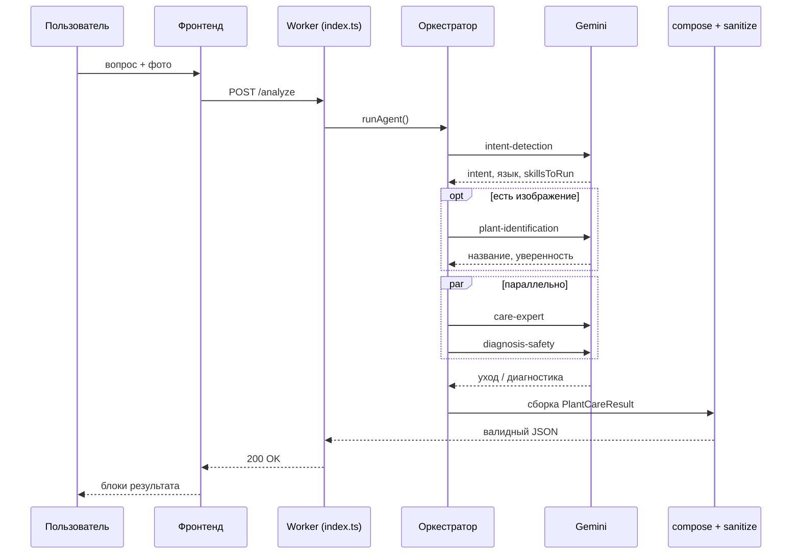

# Plant Care — архитектура и логика работы

Документ описывает полную систему **Plant Care**: фронтенд (SPA) и бэкенд (Cloudflare Worker с навыками на Gemini). Актуально для репозиториев `PlantCare` (UI) и `PlantCareBack` (API).

---

## 1. Обзор системы

Plant Care — ассистент по уходу за комнатными растениями. Пользователь задаёт вопрос и/или загружает фото; бэкенд анализирует запрос через цепочку **навыков (skills)** на базе LLM и возвращает структурированный ответ `PlantCareResult`, который фронтенд отображает блоками (Summary, Diagnosis, Identification и т.д.).

**Ключевой принцип:** фронтенд **никогда** не вызывает модель напрямую. Вся логика растений, диагностики и безопасности живёт на бэкенде.

```
┌─────────────────┐     POST /analyze      ┌──────────────────────────────┐
│  PlantCare      │  ───────────────────►  │  PlantCareBack (Worker)      │
│  (Vite + React) │  ◄───────────────────  │  Skills → Compose → Sanitize │
│  Cloudflare     │     PlantCareResult    │  Gemini + CONFIG_KV          │
│  Pages          │                        └──────────────────────────────┘
└─────────────────┘
```

| Компонент | Технологии | URL (prod) |
|-----------|------------|------------|
| Фронтенд | Vite 8, React 19, TypeScript, Tailwind | `https://plantcare.kurdyukov-leo-ger.workers.dev` |
| Бэкенд | Cloudflare Worker, TypeScript | `https://plantcareback.kurdyukov-leo-ger.workers.dev` |
| Модель | Google Gemini (`gemini-2.5-flash`) | через `GEMINI_API_KEY` (secret) |

---

## 2. Поток одного запроса `/analyze`

### 2.1. На фронтенде

1. Пользователь вводит текст и/или прикрепляет фото (`InputArea`).
2. Фото проходит валидацию и даунскейл (`lib/image.ts`).
3. Отправляется `POST /analyze` с телом `{ question, image }` и заголовком `X-Session-Id` (`lib/api.ts`).
4. Ответ `PlantCareResult` рендерится в `ResultArea`.
5. Результат сохраняется в **localStorage** (`lib/history.ts`), привязанный к session id.

### 2.2. На бэкенде

Файл входа: `src/index.ts`.

```
Клиент
  │
  ├─ CORS + проверка Origin (ALLOWED_ORIGINS)
  ├─ Rate limit (по X-Session-Id или IP)
  ├─ Валидация JSON и изображения (макс. 8 MB)
  ├─ Обязательный X-Session-Id
  │
  ▼
runAgent()  — src/agent/orchestrator.ts
  │
  ├─ Фаза 1: intent-detection (последовательно)
  ├─ Фаза 2a: plant-identification (если есть фото)
  ├─ Фаза 2b: care-expert + diagnosis-safety (параллельно)
  ├─ composeResult() — детерминированная сборка ответа
  ├─ sanitizeResult() — валидация контракта
  ├─ saveHistoryItem() — опционально в HISTORY_KV
  │
  ▼
PlantCareResult → JSON 200
```

**Важно:** между запросами нет серверного «диалога». Каждый `/analyze` — stateless pipeline. История на бэкенде (если подключён `HISTORY_KV`) не передаётся обратно в LLM.

### 2.3. Диаграмма последовательности



---

## 3. Архитектура навыков (Skills)

Навык — единица логики с **промптом**, **JSON-схемой ответа** и (опционально) **нормализацией** в коде. Все LLM-вызовы идут через `src/skills/runner.ts` → `src/gemini/client.ts`.

### 3.1. Активные навыки в pipeline

| ID | Роль | Когда запускается | Что возвращает |
|----|------|-------------------|----------------|
| `intent-detection` | Маршрутизация | Всегда, первым | Намерение, язык, список навыков, ownership (новое/существующее растение) |
| `plant-identification` | Идентификация | Если есть фото (или intent добавил) | Название, латинское имя, уверенность, альтернативы |
| `care-expert` | Уход | Почти всегда | Summary, сложность ухода, care profile, полив, сезон, onboarding |
| `diagnosis-safety` | Диагностика + безопасность | Всегда после intent (`alwaysAfterIntent`) | Здоровье, проблемы, токсичность, предупреждения |

### 3.2. Навыки вне runtime pipeline

| ID | Статус |
|----|--------|
| `frontend-response-composer` | **Legacy.** Раньше LLM собирал финальный JSON. Сейчас заменён детерминированным `compose.ts`. |
| `follow-up-questions` | Заготовка, не используется в MVP. |
| `history` | Метаданные в конфиге; сохранение истории — код в `history/store.ts`. |

### 3.3. Контекст навыка (`SkillContext`)

Каждый навык получает общий контекст:

```typescript
{
  question: string;           // текст пользователя
  image: UploadedImage | null;
  defaultLanguage: string;    // из активного агента / env
  detectedLanguage: string;   // после intent-detection
  sessionId: string;
  results: {                  // результаты предыдущих навыков
    'intent-detection'?: …,
    'plant-identification'?: …,
    …
  }
}
```

Текстовый промпт для Gemini собирается в `src/skills/helpers.ts`: метаданные запроса, язык вывода, результаты upstream-навыков, опционально изображение как `inline_data`.

### 3.4. Intent detection — логика маршрутизации

`intent-detection` решает:

- **detectedIntent** — что хочет пользователь (уход, диагностика, идентификация и т.д.).
- **skillsToRun** — какие навыки запустить (фильтруется до `plant-identification`, `care-expert`, `diagnosis-safety`).
- **detectedLanguage** — язык ответа (`ru`, `en`, `de`…).
- **ownershipTag** — `new` / `existing` / `unknown` (влияет на onboarding vs healthCheck в care-expert).
- **needsClarification** — нужны ли уточнения.

После intent оркестратор:

1. Добавляет `plant-identification`, если есть фото.
2. Добавляет навыки из `agent.pipeline.alwaysAfterIntent` (по умолчанию `diagnosis-safety`).
3. Гарантирует хотя бы один «контентный» навык (`care-expert`), чтобы summary не был пустым.
4. Фильтрует по `agent.availableSkillIds`.

### 3.5. Правило «один факт — одно поле»

В промпте `care-expert` зафиксировано: **не дублировать** информацию между `summary`, `careProfile`, `wateringPlan`, `seasonalAdvice`. Например:

- `summary` — 2–4 предложения о характере растения и прямой ответ на вопрос.
- `careDifficultyScore` — число 1–10 (сложность ухода), **не** в тексте summary.
- `wateringPlan` — вся глубина по поливу; в `careProfile.watering` — только краткий заголовок.

Композер дополнительно убирает дубли полива между `careProfile` и `wateringPlan` (`dedupeCareProfile` в `compose.ts`).

---

## 4. Оркестратор

Файл: `src/agent/orchestrator.ts`.

### Порядок выполнения

```
1. getActiveAgent(env)           → конфиг агента из CONFIG_KV
2. buildContext(req, sessionId)  → SkillContext
3. runLlmSkill(intent-detection)
4. ctx.detectedLanguage =
     текст есть → intent.detectedLanguage
     только фото → defaultLanguage агента
5. skillsForPhase(intent) + alwaysAfterIntent + fallback care-expert
6. plant-identification (последовательно, если в списке)
7. Promise.all([care-expert, diagnosis-safety, …])
8. composeResult(ctx)
9. sanitizeResult(composed)
10. saveHistoryItem (опционально)
11. return PlantCareResult
```

### Параллельность

- **Последовательно:** intent → (опционально) identification.
- **Параллельно:** `care-expert` и `diagnosis-safety` — не зависят друг от друга, но оба видят результат identification.
- **Типичное число вызовов Gemini:** 3 (intent + care + diagnosis) или 4 (с identification).

---

## 5. Композер и санитизация

### 5.1. `compose.ts` — детерминированная сборка

Файл: `src/agent/compose.ts`.

Без LLM собирает legacy-контракт `PlantCareResult` из `ctx.results`:

| Поле ответа | Источник |
|-------------|----------|
| `summary` | care-expert → diagnosis.healthStatus → identification.commonName |
| `careDifficultyScore` | care-expert (1–10) |
| `identification` | plant-identification |
| `careProfile` | care-expert (с дедупом полива) |
| `diagnosis` | diagnosis-safety |
| `wateringPlan` | care-expert |
| `seasonalAdvice` | care-expert |
| `healthCheck` | care-expert |
| `onboarding` | care-expert.onboardingSteps |
| `actionPlan` | care-expert.actionItems + onboardingSteps + diagnosis.treatmentSteps |
| `warnings` | diagnosis-safety |
| `toxicity` | diagnosis-safety |
| `preventionTips` | diagnosis-safety |

### 5.2. `sanitize.ts` — валидация контракта

Файл: `src/sanitize.ts`.

- **Обязательно:** поле `summary` (иначе `null` → HTTP 502).
- Проверяет enum-значения: confidence, severity, priority, токсичность.
- `careProfile`: допустимые ключи, без дубликатов.
- `careDifficultyScore`: целое 1–10 (поддерживает строку от модели; legacy `difficultyLevel` → 3/5/8).
- `actionPlan`: автогенерация `id` ("1", "2", …).
- `warnings`: `string[]` или legacy `{ message }[]`.

---

## 6. Контракт `PlantCareResult`

Тип: `src/types.ts` (бэкенд) и `PlantCare/src/types.ts` (фронт).

```typescript
interface PlantCareResult {
  summary: string;                    // обязательно
  careDifficultyScore?: number;       // 1–10, выше = сложнее
  warnings?: string[];
  identification?: { … };
  careProfile?: CareProfileItem[];
  diagnosis?: { healthStatus?, issues[] };
  wateringPlan?: { frequency?, amount?, method?, notes? };
  actionPlan?: { id, text, priority? }[];
  seasonalAdvice?: string;
  healthCheck?: string[];
  onboarding?: string[];
  toxicity?: { toxicToCats?, toxicToDogs?, … };
  preventionTips?: string[];
}
```

### Порядок отображения на фронтенде (`ResultArea.tsx`)

1. Предупреждения (`warnings`)
2. **Summary** (+ кольцо `careDifficultyScore`)
3. **Diagnosis** (сразу под summary)
4. Plant identification
5. Care profile
6. Watering plan
7. Action plan

---

## 7. Система конфигурации CONFIG_KV

Промпты и схемы навыков хранятся в **Cloudflare KV** и версионируются. Код в репозитории — источник истины для сидов; в runtime читается **активная версия** из KV.

### 7.1. Привязка

`wrangler.jsonc`:

```jsonc
"kv_namespaces": [
  { "binding": "CONFIG_KV", "id": "67cbe08e512b49508890b44fdae1b610" }
]
```

### 7.2. Структура KV

```
config:{skills|tools|agents}:index
config:{kind}:{id}:meta
config:{kind}:{id}:versions:index
config:{kind}:{id}:version:{versionId}
config:agent:active
```

При первом обращении, если KV пуст — `seedDefaults()` из `src/config/defaults.ts` (промпты из `src/skills/*`).

### 7.3. Активный агент по умолчанию

- ID: `plant-care-agent`
- Навыки: `plant-identification`, `care-expert`, `diagnosis-safety`
- Pipeline: `intentSkillId: intent-detection`, `alwaysAfterIntent: [diagnosis-safety]`
- Язык по умолчанию: `ru` (или `DEFAULT_LANGUAGE` из env)

### 7.4. Config API

Подробности: `docs/FRONTEND_CONFIG_API.md`.

Основные эндпоинты:

| Метод | Путь | Назначение |
|-------|------|------------|
| `GET` | `/config/catalog` | Каталог skills / tools / agents |
| `GET/PUT` | `/config/agents/active` | Production-агент |
| `POST` | `/config/{kind}/:id/versions` | Новая версия промпта/схемы |
| `PUT` | `/config/{kind}/:id/active-version` | Активировать версию |
| `POST` | `/config/reset` | Сброс к сидам из кода (только с разрешённого Origin) |

На фронтенде **Config Center** (кнопка ⚙) — UI для управления версиями без деплоя кода.

### 7.5. Резолв навыка в runtime

`src/config/resolve.ts`:

1. Базовое определение из `src/skills/registry.ts` (код).
2. Если есть CONFIG_KV — подмешиваются `systemPrompt`, `responseSchema`, флаги из активной версии.
3. `buildUserParts` и `normalize` остаются в коде навыка.

Без CONFIG_KV: `/analyze` работает на встроенных промптах; Config API для записи — 503.

---

## 8. Фронтенд (PlantCare)

### 8.1. Структура

```
src/
  App.tsx              — состояние, layout, вызов analyze
  components/
    InputArea.tsx      — ввод + фото
    ResultArea.tsx     — блоки результата
    HistoryArea.tsx    — боковая панель истории
    config/ConfigCenter.tsx  — админка конфига бэкенда
  lib/
    api.ts             — HTTP-клиент (/analyze)
    configApi.ts       — HTTP-клиент (/config/*)
    history.ts         — localStorage
    session.ts           — X-Session-Id (UUID)
```

### 8.2. Сессия и история

- **Session id:** `plantcare.sessionId` в localStorage, заголовок `X-Session-Id` на каждый запрос.
- **История на клиенте:** `plantcare.history.<sessionId>`, до 50 записей, полный `PlantCareResult`.
- **История на сервере:** эндпоинты `GET/DELETE /history` реализованы в бэкенде, но требуют binding `HISTORY_KV` (сейчас не подключён в prod `wrangler.jsonc`). Фронтенд использует localStorage.

### 8.3. Config Center vs ConfigPanel

| Компонент | Статус | Назначение |
|-----------|--------|------------|
| `ConfigCenter` | Активен (⚙ в header) | Управление skills/tools/agents на бэкенде |
| `ConfigPanel` | Не подключён к App | Legacy UI пользовательских настроек (язык, уровень ухода) |

Настройки агента для `/analyze` задаются на бэкенде (активный агент в CONFIG_KV), а не в теле запроса.

---

## 9. Gemini-клиент

Файл: `src/gemini/client.ts`.

- Единственная точка вызова: `callGeminiJson`.
- Модель: `GEMINI_MODEL` (по умолчанию `gemini-2.5-flash`).
- Режим: `responseMimeType: application/json` + `responseSchema` из навыка.
- Temperature: 0.35.
- Timeout: 45 с.
- Ошибки upstream пробрасываются с полем `detail` для отладки на фронте.

---

## 10. Безопасность и ограничения

| Механизм | Реализация |
|----------|------------|
| CORS + Origin check | `ALLOWED_ORIGINS` — только разрешённые домены для `/analyze` |
| Rate limit | `RATE_LIMIT_MAX` / `RATE_LIMIT_WINDOW_SECONDS` на session/IP |
| Секреты | `GEMINI_API_KEY` только на Worker, не на клиенте |
| Размер запроса | Content-Length ≤ 16 MB; изображение ≤ 8 MB |
| Session | `X-Session-Id` обязателен |

---

## 11. Обработка ошибок

Централизованный класс `HttpError` (`src/errors.ts`).

| Код | Типичная причина |
|-----|------------------|
| 400 | Невалидный JSON, пустой запрос, нет X-Session-Id |
| 403 | Origin не в allow-list |
| 413 | Слишком большое тело / изображение |
| 422 | Контент заблокирован Gemini |
| 429 | Rate limit |
| 502 | Пустой summary после sanitize; ошибка Gemini |
| 504 | Timeout Gemini |
| 503 | CONFIG_KV не привязан (запись в config) |

---

## 12. Деплой и переменные окружения

### Бэкенд (`wrangler.jsonc`)

| Переменная | Назначение |
|------------|------------|
| `GEMINI_API_KEY` | Secret, обязателен |
| `GEMINI_MODEL` | Модель (default: gemini-2.5-flash) |
| `ALLOWED_ORIGINS` | CORS allow-list |
| `DEFAULT_LANGUAGE` | Язык для запросов только с фото |
| `RATE_LIMIT_MAX` | Лимит запросов |
| `RATE_LIMIT_WINDOW_SECONDS` | Окно лимита |
| `MAX_IMAGE_BYTES` | Макс. размер изображения |
| `CONFIG_KV` | Binding KV для конфига |
| `HISTORY_KV` | Опционально, для серверной истории |
| `RATE_LIMIT_KV` | Опционально, durable rate limit |

### Фронтенд

| Переменная | Назначение |
|------------|------------|
| `VITE_API_BASE_URL` | URL бэкенда (default: production Worker) |

Сборка: `npm run build` → `dist/` → Cloudflare Pages.

---

## 13. Типичные сценарии

### Запрос «Как поливать фикус?» (только текст)

1. Intent → `care-expert` + `diagnosis-safety`.
2. Identification не запускается (нет фото).
3. Care-expert даёт summary, care profile, watering plan, careDifficultyScore.
4. Diagnosis-safety даёт общие предупреждения / токсичность при необходимости.
5. Compose собирает ответ; фронт показывает Summary → Diagnosis (если есть) → Care profile → Watering.

### Запрос с фото больного листа

1. Intent определяет диагностику, язык, ownership.
2. `plant-identification` → название растения.
3. Параллельно: `care-expert` (уход) + `diagnosis-safety` (проблемы, лечение, urgency).
4. Diagnosis с issues показывается сразу под Summary.

### Только фото без текста

1. Язык ответа = `defaultLanguage` агента (`ru` в prod).
2. Identification + care + diagnosis по изображению.

### Обновление промптов без деплоя кода

1. Config Center → новая версия skill → Activate.
2. Или `POST /config/reset` для полного сброса к сидам из репозитория.

---

## 14. Карта исходников

| Область | Путь |
|---------|------|
| HTTP router | `src/index.ts` |
| Оркестратор | `src/agent/orchestrator.ts` |
| Композер | `src/agent/compose.ts` |
| Санитизация | `src/sanitize.ts` |
| Gemini | `src/gemini/client.ts` |
| Skill runner | `src/skills/runner.ts` |
| Реестр навыков | `src/skills/registry.ts` |
| Сиды конфига | `src/config/defaults.ts` |
| Config API | `src/config/routes.ts`, `service.ts`, `resolve.ts` |
| История (сервер) | `src/history/store.ts` |
| API types | `src/types.ts` |
| Config API (док) | `docs/FRONTEND_CONFIG_API.md` |
| Фронт: результат | `PlantCare/src/components/ResultArea.tsx` |
| Фронт: API | `PlantCare/src/lib/api.ts` |

---

## 15. Эволюция архитектуры (кратко)

1. **Было:** один LLM-вызов или `frontend-response-composer` собирал JSON.
2. **Стало:** intent → специализированные skills → детерминированный `compose.ts`.
3. **Плюсы:** предсказуемая форма ответа, меньше галлюцинаций в структуре, параллельные навыки, версионируемые промпты в KV.
4. **Контракт с фронтом:** `careDifficultyScore` (1–10) вместо корневого `confidence`; confidence остаётся только в блоке identification.
